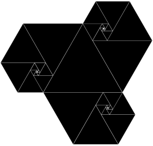

1.起因是这样的。看到一个分形图：

想计算一下相邻三角形的边长之比。发现有一个关系：

$x^5+x=1$

此外，这些三角形的面积的和，直觉上应该是一个等比求和，因为它是分形图案，所以三角形边长是一个等比数列。而这个等比和的极限就是整个图案的面积。所以：

$$
\lim \frac{\frac{\sqrt{3}}{4}(1-x^{2n})}{1-x^2}=\frac{\sqrt{3}}{4}+\frac{\sqrt{3}}{2}x^4+(x^2+2x^3+x^7)\frac{\sqrt{3}}{2}x^3/2
\\
\Rightarrow 3x^4+x^3-2x^2-3x+2=0
$$

所以，这两个方程有一个共同的零点。

然后就在想怎么从代数上找到一个证明。它们是可以通过代数变换得到的吗？
先把第二个式子往第一个式子的形式上靠一下：
=3(x4+1)-1+x(x2-2x-3)

1式可以认为是给2式子施加了一个约束，借助这个约束，就像是打通了原先很多不可以走的路，让2有了更多的变形的可能。

这里有一个规律：如果我们把x4+1代换掉，然后再通分，最就会得到一个形如p(x)/x的式子，p(x)是一个新的多项式。里面也有4次项。

所以可以重复这个操作，观察系数变化：
A B   C D E (x4) 
E A-E B C D

所以系数之和为：A+B+C+D,   A+B+C,...

然后真的去算一下上面的系数，惊奇地发现它是有周期的!

而这个系数变化如果是有周期的，那么就等于

$
f(x)/x^a  =f(x)/x^b  \Rightarrow f(x)=0
$

---

进一步地，可以把它推广为对一个n次多项式施加某个约束，只要这个约束能将多项式中的一些系数打包替换为$C/x^i$，那么这个系数滚动的方法就都可以适用。当然，为了保证循环的存在，这个打包的方法估计是不能太复杂的。
由于需要打包为$C/x^i$，所以作为约束的式子的次数需要比n大。

---

思考1    既然我们把一个五次多项式的零点转换为了四次，那能不能把这个四次多项式用来作为约束，构造一个产生循环的三次多项式？

直觉上感觉，为了产生循环，我们要把这个三次多项式所有系数的绝对值的范围控制在一个范围内，并保证每次迭代它的系数都不超过这个范围。否则，如果这些系数构成的向量的2范数，或者1范数可以随意增大，产生循环似乎就很难了。
然后来看这个具体的例子。上述过程中，以四次多项式作为约束，假设三次多项式系数为A B C D，计算一次迭代后的系数:

$$
\frac{-2D}{3},A+\frac{3D}{3},B+\frac{2D}{3},C-\frac{D}{3}
$$
看起来一团糟

---

思考2  为啥上述迭代刚好会产生循环？

---

思考3

借助现代计算机绘图，还会有一些新的发现：
1.它们还都通过（1，1）。
2.计算f/g，会很容易发现它是一个双曲线。

---

思考4

在有理数上，产生这样的循环可能不太容易，但是同余意义上似乎就会容易很多了。